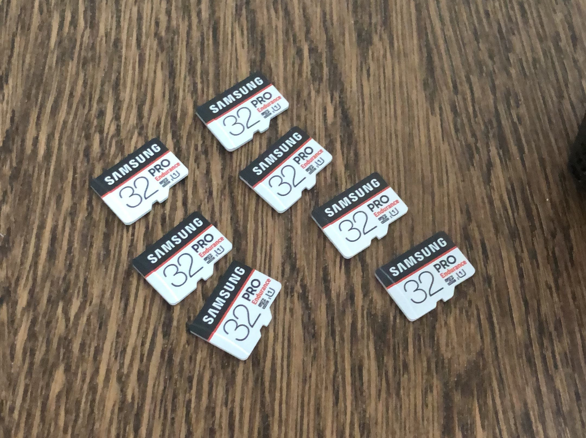
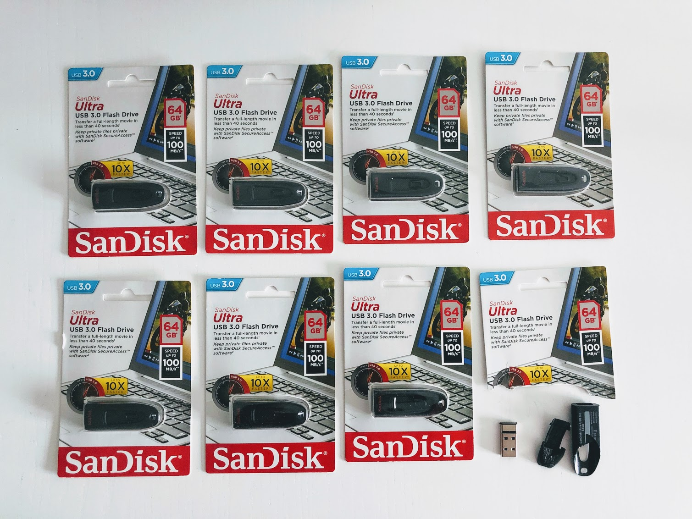
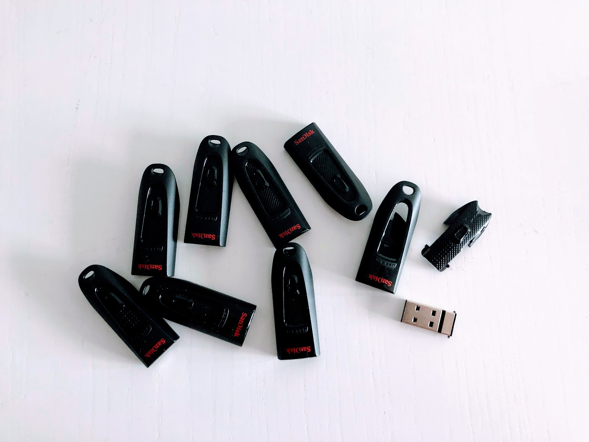
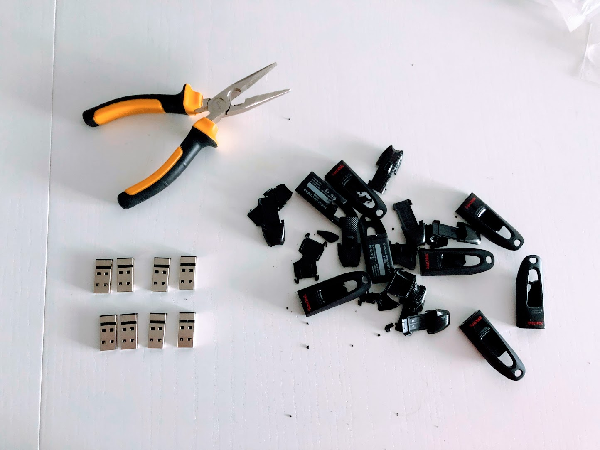
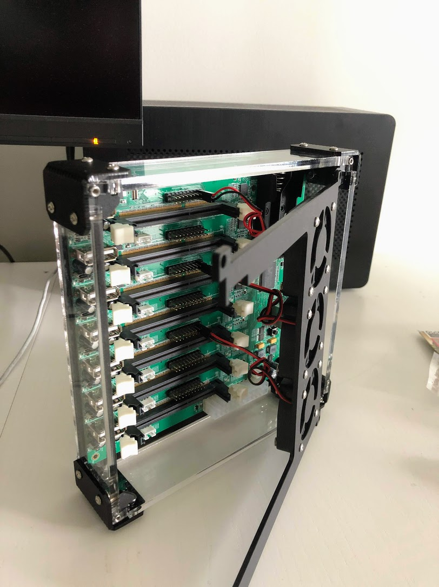

# Hardware Setup

## Armbian compatible Single Board Computers

Armbian was chosen as the distribution of choice due to its stability and the large community support. Other debian based images should also work.

For SoPine64s, please download [this image](https://dl.armbian.com/pine64so/Debian_buster_next.7z) and flash it on all the boards. I recommend using [BalenaEtcher](https://www.balena.io/etcher/).

Now is a great time to unpack and prepare the usb flash drives:

One was used to understand the ratio of plastic housing to actual components.

I needed to achieve the same size as they wouldn't fit in the Clusterboard enclosure.

There is no need to format them at the moment, that will be done on the SBCs themselves.

Now it's time to plug everything in:

Next: [Installing Kubernetes](02-installing-kubernetes.md)
