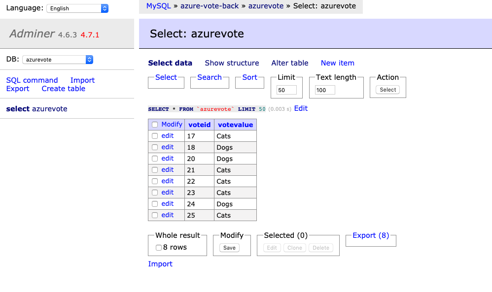

# Database Setup

## We have a dynamically provisioned, replicated storage pool using USB flash drives, let's start taking advantage of it

I found this to be the best way of installing a mysql compatible database on arm64 https://github.com/Yolean/kubernetes-mysql-cluster.

> Note, everything bitnami requires to use their images which are very difficult to build for arm64 (Maybe someday I will recompile everything, but for now it seemed overkill)

```
kubectl apply -f mariadb/
openssl rand -base64 24
kubectl exec mariadb-0 -- mysql -e "CREATE USER 'root'@'%' IDENTIFIED BY 'USE_YOUR_PASSWORD_HERE'; GRANT ALL ON *.* TO 'root'@'%' WITH GRANT OPTION;"
```

If you desire to get access using a nice GUI, please use the provided adminer YAML.


[adminer](https://hub.docker.com/_/adminer/) thanks to [acehko](https://github.com/acehko/kubernetes-examples/tree/master/adminer)

```
kubectl apply -f yamls/adminer.yaml
kubectl port-forward svc/adminer 8080:80
```

For those who are interested in extracting metrics in order to run `kubectl top nodes`, one extra step is required:

Add the command line argument `--kubelet-arg="address=0.0.0.0"` to expose metrics to all the Pine64's k3s-server and k3s-agent services.

```
root@pine02:~# cat /etc/systemd/system/k3s-agent.service
[Unit]
Description=Lightweight Kubernetes
Documentation=https://k3s.io
After=network-online.target

[Service]
Type=exec
EnvironmentFile=/etc/systemd/system/k3s-agent.service.env
ExecStartPre=-/sbin/modprobe br_netfilter
ExecStartPre=-/sbin/modprobe overlay
ExecStart=/usr/local/bin/k3s agent --kubelet-arg="address=0.0.0.0"

KillMode=process
Delegate=yes
LimitNOFILE=infinity
LimitNPROC=infinity
LimitCORE=infinity
TasksMax=infinity
TimeoutStartSec=0
Restart=always
RestartSec=5s

[Install]
WantedBy=multi-user.target
```

Next: [WordPress](06-wordpress.md)
