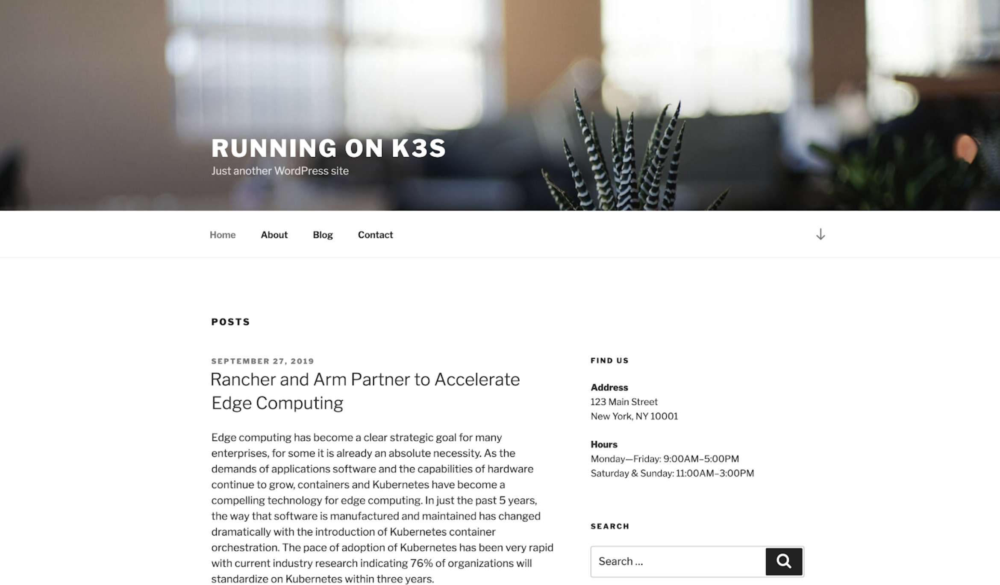

## Hello Wordpress, my old friend

After spending the entire time debugging configuration and rebuilding docker images, I was not in the mood of writing a sample application that leverages ingress and persistent volume claims, that also managed to look nice.

Fortunately, Wordpress has still been around since the time I was a teenager and was building blogs.

```
kubectl apply -f yamls/wordpress.yml
```

Make sure to adjust the domain in yamls/ingress.yaml and then apply:

```
kubectl apply -f yamls/ingress.yaml
```

Website available at https://blog.mad.md (You should have a different domain)

You can check PVC `k get pvc`:


Our dynamically provisioned volume claims are working and you can even scale your statefulset.

That's it! I hope you had fun while creating your portable Kubernetes cluster.


