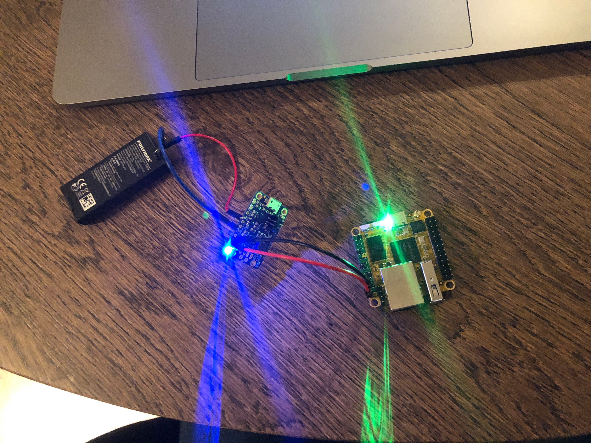
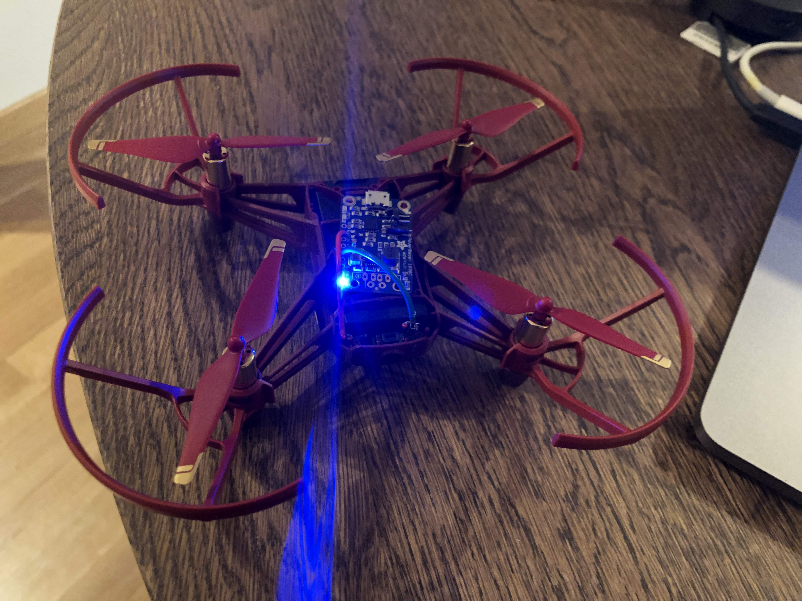
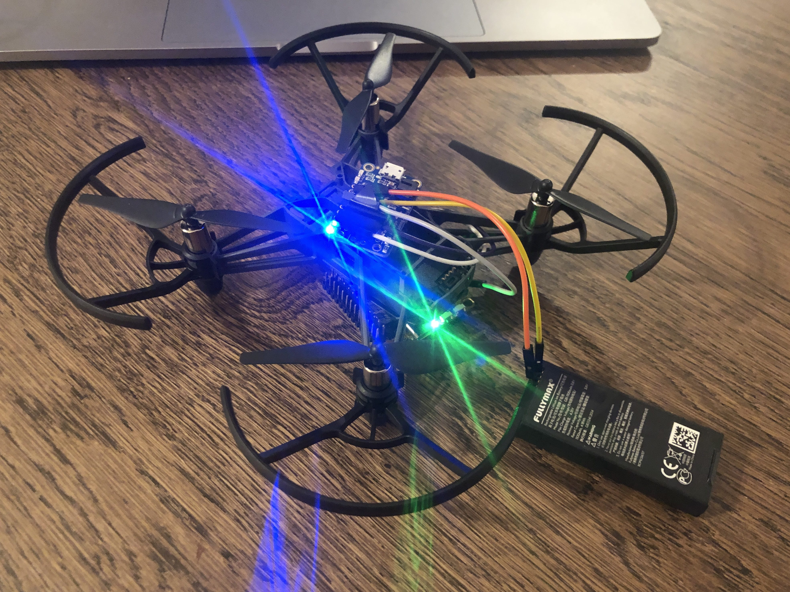
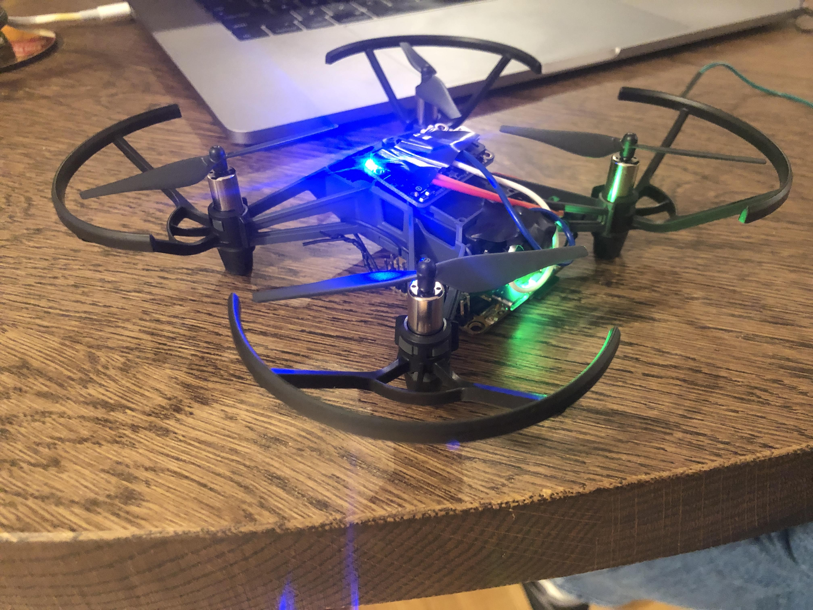
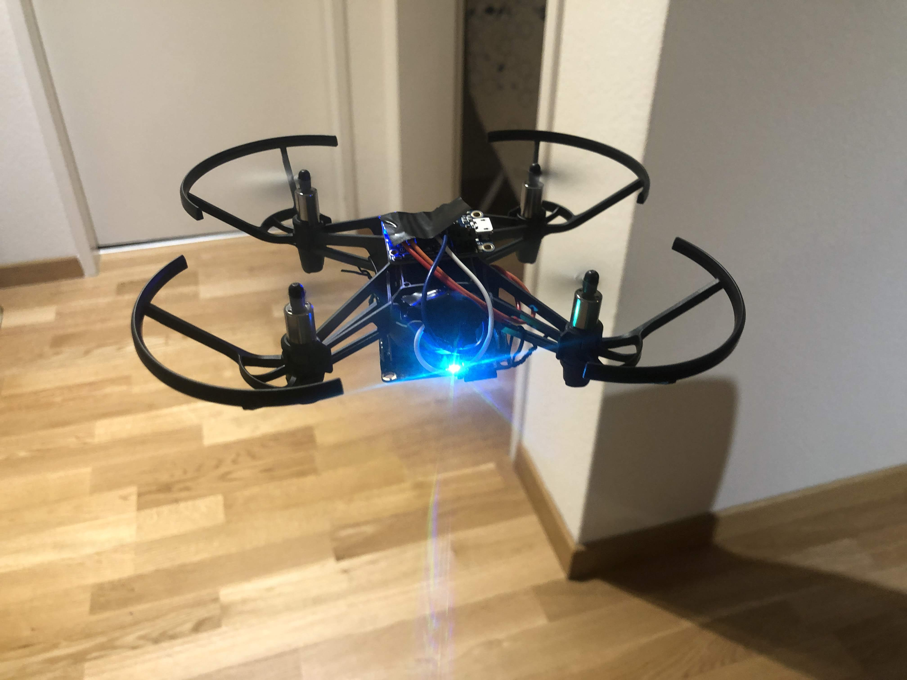

# Hardware Setup

Connect the drone battery to the Rock Pi S single board computer using the Adafruit voltage booster

Turn on the Tello drone and realize that the regular one does not support connecting to existing wifi networks.

Test controlling the Tello EDU drone with a different wifi and [Gobot](https://github.com/hybridgroup/gobot) (video)

Use double-sided tape to secure the voltage booster and the Rock Pi S to the drone.

Finish securing all the cable using tape and prepare the drone to fly with a Kubernetes node attached to it.

> Note: Yes, I am using zip ties to secure the Rock Pi S

## Celebrate!

Next: [Drone Pod](02-drone-pod.md)
