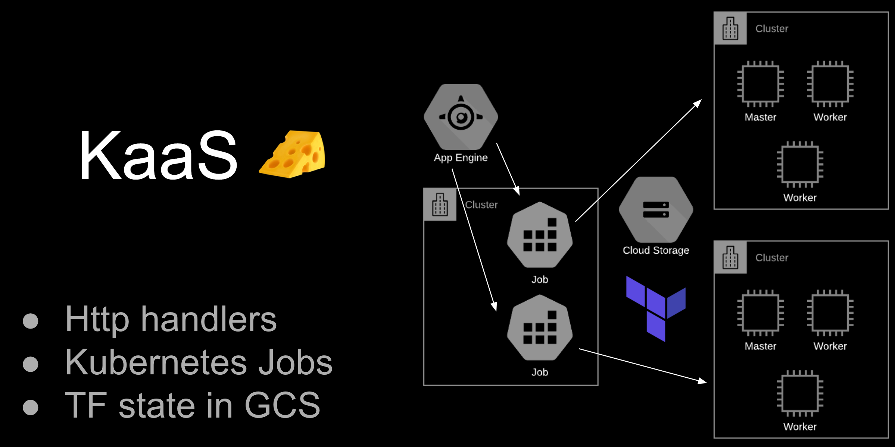

# Building your own Kubernetes as a Service

#### Virtual Rejekts 2020 [recording](https://www.youtube.com/watch?v=cZEcdTOwV-A&feature=youtu.be&t=18200) and [slides](https://docs.google.com/presentation/d/1d7i4DqIV4K--jqLNlZVVJlSgOWu0HeSgVMHnaZtIPlc/edit)

The purpose of this repository is to provision development clusters in a really simple and fast way. Result of [this](https://twitter.com/errordeveloper/status/1240262848351211520) twitter thread.

> Please note, do not run this in production

## Target Audience

The target audience for episode #4 is someone who is familiar with Kubernetes. Terraform and Go knowledge will prove useful.

## Cluster Details

- [Manageg Kubernetes from Digital Ocean](https://www.digitalocean.com/products/kubernetes/)

## IaaS

- [Google Cloud Storage](https://cloud.google.com/storage) to store Terraform state and kubeconfig files
- [Google App Engine](https://cloud.google.com/appengine) to host [KaaS Server](kaas/README.md)

## Steps

- [Simple Typhoon K8s](docs/01-simple-typhoon-k8s.md)
- [KaaS Server](docs/02-kaas-server.md)
