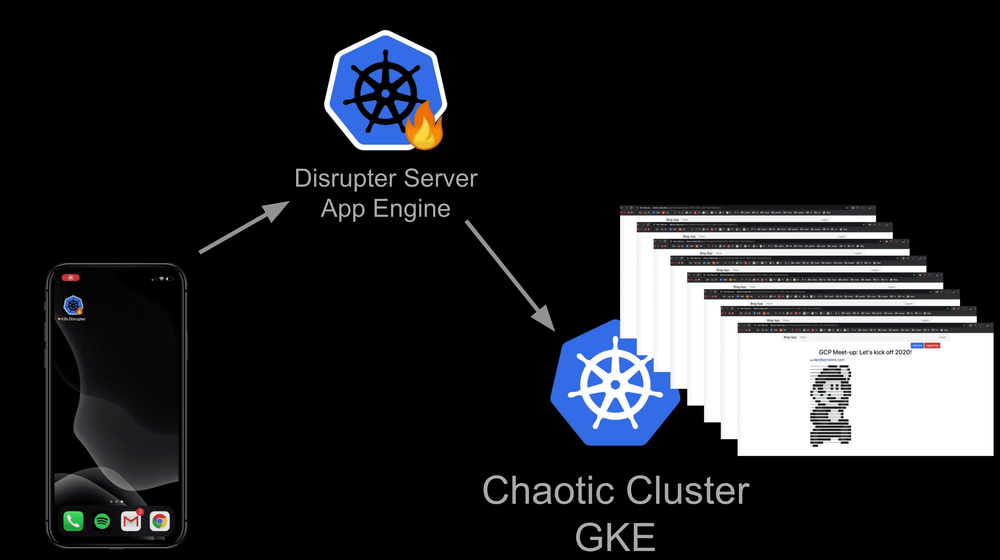

# Kubernetes The Fun Way

## Update!

#### Episode 4 will be presented live at [Virtual Rejekts](https://cfp.cloud-native.rejekts.io/virtual-rejekts-2020/talk/XDGMZR/)

Kubernetes the Fun Way is a collection of case studies in which Kubernetes and other cloud-native technologies are explored in unrealistic and (somewhat) ridiculous scenarios. The hope is to create a fun and inclusive learning environment

The episodes are inspired by my day to day work handling production scenarios and are then reapplied with fun twists to create a fun learning environment where failure is the expected goal, as it lowers the barrier of entry.

## Episodes:

- #### [03:](03-chaos-engineering-on-kubernetes/) Chaos Engineering on Kubernetes ([recording](https://www.youtube.com/watch?v=5JLOkjbkNg4) and [slides](https://docs.google.com/presentation/d/1jSparcqR4NsaG4yOnEbE7AxnNnr1xLVwkIBjbfKzc4k/edit?usp=sharing))

  
  Destroying virtual machines in a un-suspecting GKE cluster

- #### [02:](02-kubernetes-operator-for-drones/) Kubernetes Operators for Drones ([recording](https://www.youtube.com/watch?v=JPVgxnsvOs0) and [slides](https://docs.google.com/presentation/d/1VVZ1QPbae4Pnqr-sKEO4knL-2mwz-ijWt-AhJGu6EYQ/edit?usp=sharing))

  
  Building a Kubernetes operator for drones, attaching worker nodes to the drones, and launching them in the air

- #### [01:](01-portable-kubernetes-cluster/) Portable Kubernetes cluster ([recording](https://www.youtube.com/watch?v=83oLS3mP7XQ) and [slides](https://docs.google.com/presentation/d/1RdEzRpNtCz1NRyWGr8kKeqVn6NNrAXfzvX8qxi4BanY/edit?usp=sharing))

  
  Running a Kubernetes cluster on Arm64 single board computers in my living room and creating a ceph pool managed by Rook using USB Flash Drives just to run a Wordpress blog

##### #kubernetes 

### Acknowledgements:

This project was greatly inspired by [Kubernetes The Hard Way](https://github.com/kelseyhightower/kubernetes-the-hard-way) and [TGI Kubernetes](https://github.com/vmware-tanzu/tgik)
