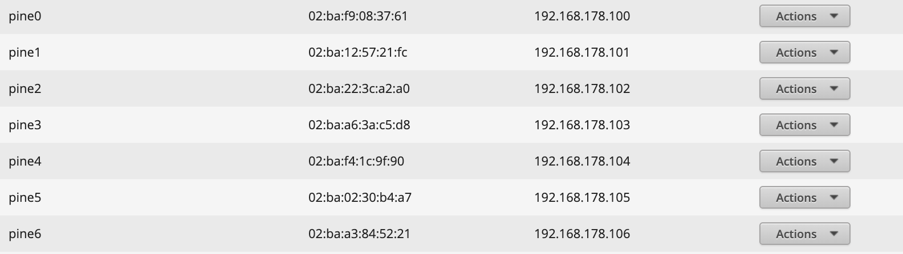
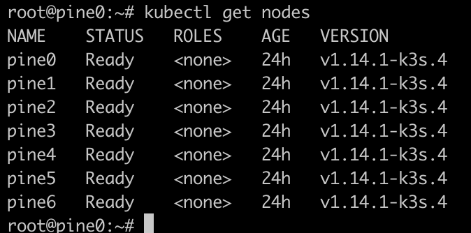

# Kubernetes Setup

## Installing K3s on Armbian

K3s is a [Lightweight Certified Kubernetes Distribution](https://landscape.cncf.io/selected=k3s) which runs well on Arm64. I would not recommend running upstream Kubernetes as you will hit resource limits quite fast and the experience will not be fun.

I strongly recommend spending the time and assigning static leases to your devices:



Once all machines are booted up, [please run tmux with synchronize panes enabled](https://github.com/kelseyhightower/kubernetes-the-hard-way/blob/master/docs/01-prerequisites.md#running-commands-in-parallel-with-tmux) to make sure you will be typing commands only once instead of copy pasting 6 times.


> Note, I am running all commands as root (BAD PRACTICE!!!). Only do this for development environments. You can set up your user account in Armbian on first boot, but I skipped this step.

We will be running ceph, it is necessary to run a kernel which supports [RBD](http://docs.ceph.com/docs/jewel/man/8/rbd/). I had to build a new one because ours doesn't support it. Armbian offers a [kernel build tool](https://docs.armbian.com/Developer-Guide_Build-Preparation/) for supported devices.

> I managed to successfully build the kernel on Ubuntu 19.04 using the docker option: `./compile.sh docker` (you don't need to build on an arm64 machine)

Download the precompiled kernel to all the devices and install it:
```
wget https://github.com/danacr/kubernetes-the-fun-way/releases/download/v0.1/linux-image-next-sunxi64_5.89_arm64.deb
dpkg -i linux-image-next-sunxi64_5.89_arm64.deb
```

It is also a good time to install lvm2, as it is a requirement for rook:

```
apt-get update && apt-get install -y lvm2
```

To install Kubernetes, pick a node to be a master and run the following:
```
curl -sfL https://get.k3s.io| sh -
cat /var/lib/rancher/k3s/server/node-token
```

Save the token and ip address of the master. At this point it would be great to exit the master node tmux window, while keeping the others synchronized.

The k3s sh script supports environment variables to automate the joining phase:

```
curl -sfL https://get.k3s.io | K3S_URL=https://MASTER_NODE_IP:6443 K3S_TOKEN=LONG_TOKEN sh -
```

Once all installs finish, you should be able to run `kubectl get nodes` on the master node:



If you encounter errors, try running the server or agent using `--debug`:

```
k3s --debug server
or
k3s --debug agent --server https://MASTER_NODE_IP:6443 --token LONG_TOKEN
```

I strongly recommend restarting your cluster at this point, to make sure it survives reboots.

Next: [Creature Comfort](03-creature-comfort.md)
