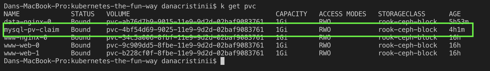

# Example Application

## This needs to be tested

After spending the entire time debugging configuration and rebuilding docker images, I was not in the mood of writing a sample application that leverages ingress and persistent volume claims.

I remembered that Azure had some simple voting application as an example for deploying on their kubernetes clusters: https://github.com/Azure-Samples/azure-voting-app. 

Forked, rebuilt all the docker images with arm64 support, and their dependencies for your convenience:

> Note, if you would like to know how to build arm64 images on your amd64 machine, please see [this post](https://medium.com/@carlosedp/cross-building-arm64-images-on-docker-desktop-254d1e0bc1f9)

```
kubectl apply -f yamls/azure-voting-app.yaml
```

Make sure to adjust the domain in yamls/ingress.yaml and then apply:

```
kubectl apply -f yamls/ingress.yaml
```

Website available at https://cluster.mad.md (You should have a different domain)

You can check PVC `k get pvc`:



I have also included [adminer](https://hub.docker.com/_/adminer/) thanks to [acehko](https://github.com/acehko/kubernetes-examples/tree/master/adminer) if you want to see the database entries for the votes to make sure that it survives crashes and reboots.

```
kubectl apply -f yamls/adminer.yaml
kubectl port-forward svc/adminer 8080:80
```
Adminer available at: http://localhost:8080/. Server: `azure-vote-back`, username: `root`, password: `Password12`


That's it! I hope you had fun while creating your portable Kubernetes cluster.
